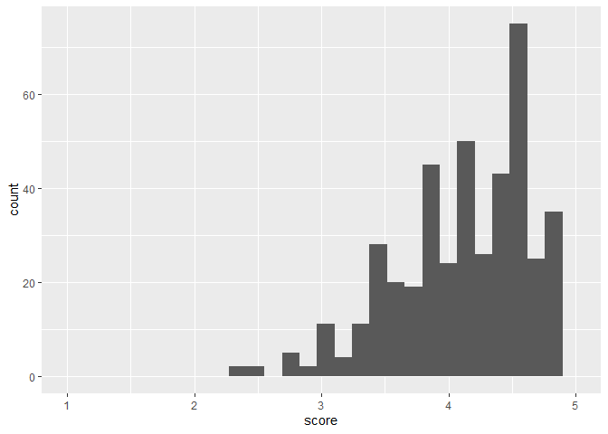
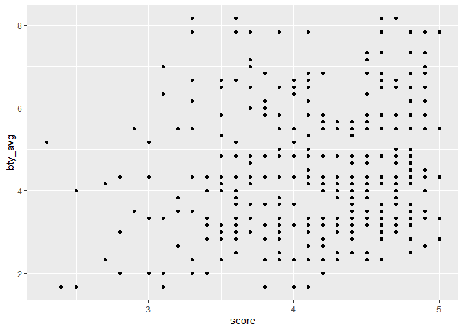
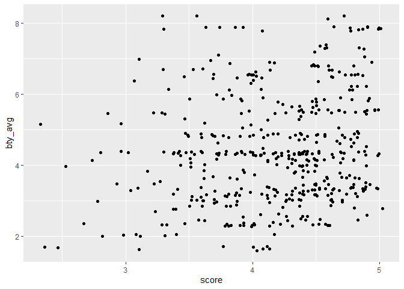
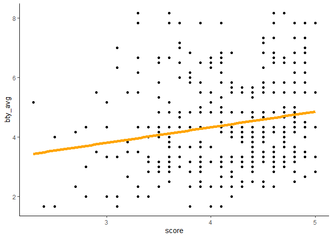

Lab 9
================
Ben Hardin
2023-03-10

``` r
library(tidyverse) 
```

    ## ── Attaching packages ─────────────────────────────────────── tidyverse 1.3.2 ──
    ## ✔ ggplot2 3.4.0      ✔ purrr   0.3.5 
    ## ✔ tibble  3.1.8      ✔ dplyr   1.0.10
    ## ✔ tidyr   1.2.1      ✔ stringr 1.5.0 
    ## ✔ readr   2.1.3      ✔ forcats 0.5.2 
    ## ── Conflicts ────────────────────────────────────────── tidyverse_conflicts() ──
    ## ✖ dplyr::filter() masks stats::filter()
    ## ✖ dplyr::lag()    masks stats::lag()

``` r
library(broom)
library(openintro)
```

    ## Loading required package: airports
    ## Loading required package: cherryblossom
    ## Loading required package: usdata

### Exercise 1

``` r
ggplot(evals, aes(x = score))+
  geom_histogram()
```

    ## `stat_bin()` using `bins = 30`. Pick better value with `binwidth`.

<!-- -->

### Exercise 2

``` r
ggplot(evals, aes(x = score, y = bty_avg))+
  geom_point()
```

<!-- -->

### Exercise 3

``` r
ggplot(evals, aes(x = score, y = bty_avg))+
  geom_jitter()
```

<!-- -->

### Exercise 4

``` r
m_bty <- lm(data = evals, score ~ bty_avg)

summary(m_bty)
```

    ## 
    ## Call:
    ## lm(formula = score ~ bty_avg, data = evals)
    ## 
    ## Residuals:
    ##     Min      1Q  Median      3Q     Max 
    ## -1.9246 -0.3690  0.1420  0.3977  0.9309 
    ## 
    ## Coefficients:
    ##             Estimate Std. Error t value Pr(>|t|)    
    ## (Intercept)  3.88034    0.07614   50.96  < 2e-16 ***
    ## bty_avg      0.06664    0.01629    4.09 5.08e-05 ***
    ## ---
    ## Signif. codes:  0 '***' 0.001 '**' 0.01 '*' 0.05 '.' 0.1 ' ' 1
    ## 
    ## Residual standard error: 0.5348 on 461 degrees of freedom
    ## Multiple R-squared:  0.03502,    Adjusted R-squared:  0.03293 
    ## F-statistic: 16.73 on 1 and 461 DF,  p-value: 5.083e-05

### Exercise 5

``` r
ggplot(evals, aes(x = score, y = bty_avg))+
  geom_point()+
  geom_smooth(method = "lm", se = F, color = "orange", linewidth = 2)+
  theme_classic()
```

    ## `geom_smooth()` using formula = 'y ~ x'

<!-- -->

### Exercise 6

…

### Exercise 7

…

### Exercise 8

…

### Exercise 9

``` r
m_gen <- lm(data = evals, score ~ gender)

summary(m_gen)
```

    ## 
    ## Call:
    ## lm(formula = score ~ gender, data = evals)
    ## 
    ## Residuals:
    ##      Min       1Q   Median       3Q      Max 
    ## -1.83433 -0.36357  0.06567  0.40718  0.90718 
    ## 
    ## Coefficients:
    ##             Estimate Std. Error t value Pr(>|t|)    
    ## (Intercept)  4.09282    0.03867 105.852  < 2e-16 ***
    ## gendermale   0.14151    0.05082   2.784  0.00558 ** 
    ## ---
    ## Signif. codes:  0 '***' 0.001 '**' 0.01 '*' 0.05 '.' 0.1 ' ' 1
    ## 
    ## Residual standard error: 0.5399 on 461 degrees of freedom
    ## Multiple R-squared:  0.01654,    Adjusted R-squared:  0.01441 
    ## F-statistic: 7.753 on 1 and 461 DF,  p-value: 0.005583

### Exercise 10

…

### Exercise 11

``` r
m_rank <- lm(data = evals, score ~ rank)

summary(m_rank)
```

    ## 
    ## Call:
    ## lm(formula = score ~ rank, data = evals)
    ## 
    ## Residuals:
    ##     Min      1Q  Median      3Q     Max 
    ## -1.8546 -0.3391  0.1157  0.4305  0.8609 
    ## 
    ## Coefficients:
    ##                  Estimate Std. Error t value Pr(>|t|)    
    ## (Intercept)       4.28431    0.05365  79.853   <2e-16 ***
    ## ranktenure track -0.12968    0.07482  -1.733   0.0837 .  
    ## ranktenured      -0.14518    0.06355  -2.284   0.0228 *  
    ## ---
    ## Signif. codes:  0 '***' 0.001 '**' 0.01 '*' 0.05 '.' 0.1 ' ' 1
    ## 
    ## Residual standard error: 0.5419 on 460 degrees of freedom
    ## Multiple R-squared:  0.01163,    Adjusted R-squared:  0.007332 
    ## F-statistic: 2.706 on 2 and 460 DF,  p-value: 0.06786

### Exercise 12

``` r
evals <- evals %>%
  mutate(rank_relevel = case_when(
    rank == "tenure track" ~ 0,
    rank == "tenured" ~ 1,
    rank == "teaching" ~ -1))
```

### Exercise 13

``` r
m_rank_relevel <- lm(data = evals, score ~ rank_relevel)

summary(m_rank_relevel)
```

    ## 
    ## Call:
    ## lm(formula = score ~ rank_relevel, data = evals)
    ## 
    ## Residuals:
    ##     Min      1Q  Median      3Q     Max 
    ## -1.8963 -0.3302  0.1037  0.4037  0.8698 
    ## 
    ## Coefficients:
    ##              Estimate Std. Error t value Pr(>|t|)    
    ## (Intercept)   4.19626    0.02713 154.665   <2e-16 ***
    ## rank_relevel -0.06601    0.03098  -2.131   0.0337 *  
    ## ---
    ## Signif. codes:  0 '***' 0.001 '**' 0.01 '*' 0.05 '.' 0.1 ' ' 1
    ## 
    ## Residual standard error: 0.5418 on 461 degrees of freedom
    ## Multiple R-squared:  0.009751,   Adjusted R-squared:  0.007603 
    ## F-statistic: 4.539 on 1 and 461 DF,  p-value: 0.03365

### Exercise 14

``` r
evals <- evals %>%
  mutate(tenure_eligible = if_else(rank == "teaching", "no", "yes"))
```

### Exercise 15

``` r
m_tenure_eligible <- lm(data = evals, score ~ tenure_eligible)

summary(m_tenure_eligible)
```

    ## 
    ## Call:
    ## lm(formula = score ~ tenure_eligible, data = evals)
    ## 
    ## Residuals:
    ##     Min      1Q  Median      3Q     Max 
    ## -1.8438 -0.3438  0.1157  0.4360  0.8562 
    ## 
    ## Coefficients:
    ##                    Estimate Std. Error t value Pr(>|t|)    
    ## (Intercept)          4.2843     0.0536  79.934   <2e-16 ***
    ## tenure_eligibleyes  -0.1406     0.0607  -2.315    0.021 *  
    ## ---
    ## Signif. codes:  0 '***' 0.001 '**' 0.01 '*' 0.05 '.' 0.1 ' ' 1
    ## 
    ## Residual standard error: 0.5413 on 461 degrees of freedom
    ## Multiple R-squared:  0.0115, Adjusted R-squared:  0.009352 
    ## F-statistic: 5.361 on 1 and 461 DF,  p-value: 0.02103
